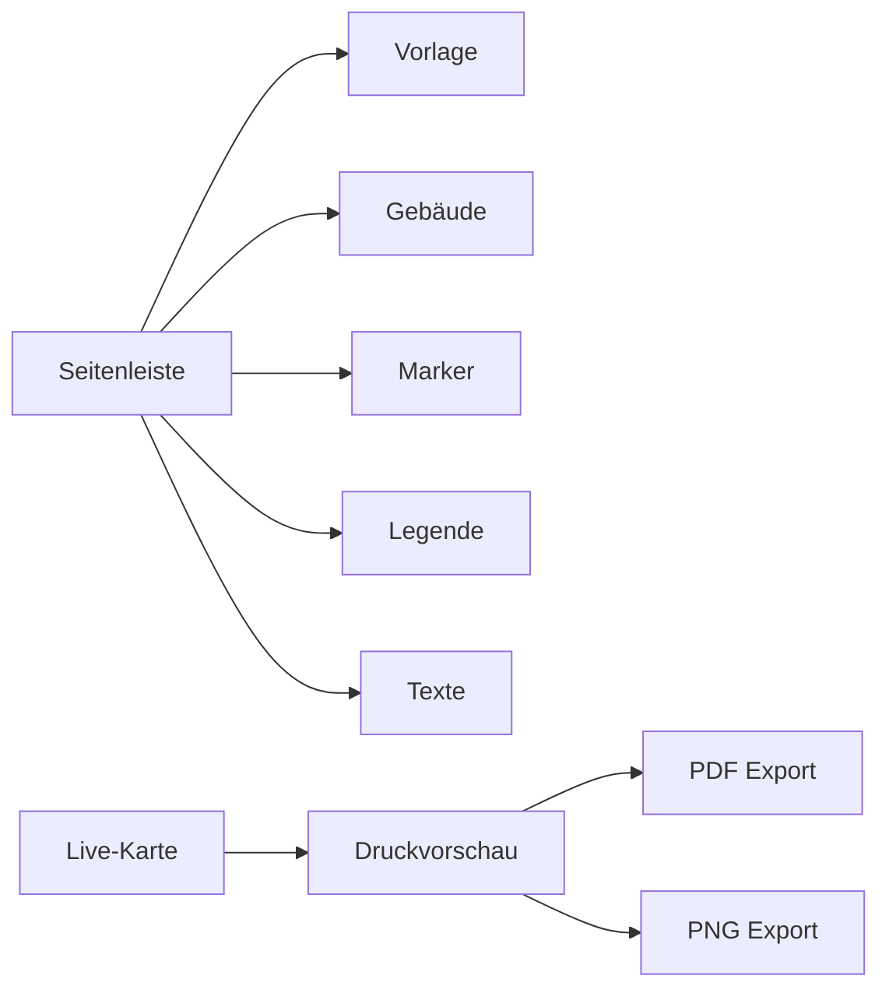

# Campus-Kartentool Pflichtenheft

## Ziel

Ein One-Pager zur Erstellung, Anpassung und Ausgabe veranstaltungsspezifischer Campus-Karten des Goetheanum.

Version 1 fokussiert auf:

- ein faltbares `A4 quer` Druckformat
- `3 mm` Beschnitt auf allen Seiten
- Schnittmarken
- Live-Vorschau
- druckfähigen PDF-Export

Die Anwendung muss nicht nur Texte austauschen, sondern die Kartenlogik selbst abbilden:

- Gebäude aktivieren, abschwächen oder ausblenden
- Marker und Piktogramme setzen
- Legenden strukturieren
- Anlass-spezifische Varianten als Presets speichern

## Ausgangslage

Die vorliegenden Beispiele zeigen mehrere Kartenanwendungen mit gemeinsamer kartografischer Basis:

- Reader-Karten mit Legende und nummerierten Punkten
- Karten mit spezifischen Lokalisierungen für einzelne Veranstaltungen
- Willkommens- und Orientierungsvarianten an Eingängen

Die Beispiele belegen, dass der reale Möglichkeitsraum aus mindestens vier Ebenen besteht:

1. Grundkarte
2. Gebäudezustände
3. Marker- und Orientierungsebene
4. Legenden- und Textebene

## Abgrenzung V1

### Muss

- eine Campus-Basiskarte mit adressierbaren Gebäuden
- interaktive Gebäudezustände
- Marker mit Position, Typ und Sichtbarkeit
- editierbare Legende mit Gruppen
- DE/EN Sprachumschaltung
- Live-Vorschau
- PDF-Export für Druck mit Beschnitt und Schnittmarken
- PNG-Vorschauexport

### Nicht in V1

- mehrere vollständig unterschiedliche Kartenbasen
- freie Bearbeitung von Gebäudegeometrien
- Banner- oder Leitsystem-Sonderformate
- Import aus InDesign oder Illustrator
- beliebig komplexe Mehrsprachigkeit
- automatische Layout-Adaption für viele Papierformate

## Nutzeraufgaben

1. Anlass auswählen oder neue Karte anlegen.
2. Relevante Gebäude hervorheben oder abschwächen.
3. Marker und Piktogramme platzieren.
4. Legenden-Einträge anlegen, sortieren und gruppieren.
5. Sprache und Kartenstil einstellen.
6. Druck-PDF prüfen und exportieren.

## Fachmodell

### Schichten

#### 1. Grundkarte

- Wege
- Wasserflächen
- Platzflächen
- Gebäudeflächen
- fixe topografische Elemente

#### 2. Gebäudezustände

Jedes Gebäude benötigt mindestens einen steuerbaren Zustand:

- `default`
- `highlighted`
- `muted`
- `hidden`

Optional für V2:

- `accent`
- `group-highlighted`

#### 3. Marker und Orientierung

- nummerierte Marker
- Treppe
- Lift
- Bus
- Bahnhof
- Parking
- optionale benutzerdefinierte Icons

#### 4. Legende und Texte

- Gruppenüberschriften
- nummerngebundene Einträge
- freie Hinweise
- Zusatzzeilen zu Stockwerken oder Zugängen
- Anlass-Titel

## Datenmodell

```ts
type OutputPreset = "a4-landscape-folded"

type BuildingState = "default" | "highlighted" | "muted" | "hidden"

type MarkerKind =
  | "number"
  | "stairs"
  | "lift"
  | "bus"
  | "train"
  | "parking"
  | "custom"

type MapDocument = {
  id: string
  name: string
  baseMapId: string
  outputPreset: OutputPreset
  language: "de" | "en"
  buildings: Array<{
    id: string
    label: string
    state: BuildingState
  }>
  markers: Array<{
    id: string
    kind: MarkerKind
    x: number
    y: number
    label?: string
    color?: string
    visible: boolean
    linkedLegendItemId?: string
  }>
  legendGroups: Array<{
    id: string
    title?: string
    visible: boolean
    items: Array<{
      id: string
      markerId?: string
      number?: string
      title: string
      subtitle?: string
      visible: boolean
    }>
  }>
  textBlocks: {
    title?: string
    subtitle?: string
    notes?: string[]
  }
  style: {
    buildingHighlightColor: string
    buildingMutedOpacity: number
    markerPalette: string[]
    backgroundMode: "default" | "light" | "muted"
  }
}
```

## Anforderungen an die Kartenbasis

Die Basiskarte darf nicht nur als flaches Hintergrundbild vorliegen. Für V1 wird eine strukturierte Vektorquelle benötigt:

- SVG oder ein daraus generiertes internes JSON
- jedes Gebäude mit stabiler ID
- getrennte Ebenen für Gebäude, Wege, Wasser, Sonstiges
- konsistente Koordinatenbasis für Marker und Export

Empfehlung:

- Illustrator- oder PDF-Quelle einmalig in ein `master SVG` überführen
- Gebäudeflächen und Basisflächen technisch sauber benennen
- diese Masterdatei als kanonische Datenquelle im Projekt halten

## UI-Konzept

Ziel ist ein One-Pager mit klarer Arbeitslogik. Die Karte ist das primäre Arbeitsfeld.

### Layout

- rechte Hauptspalte: große Live-Karte
- linke Seitenleiste: Konfigurationsmodule
- unter der Karte: Export und Produktionsvorschau

### Module

#### Vorlage

- Kartenvorlage
- Ausgabepreset
- Beschnitt ein/aus
- Falz-/Sicherheitszonen ein/aus

#### Gebäude

- Gebäude direkt auf der Karte anklicken
- Status per Segmentsteuerung ändern
- zusätzlich Listenansicht aller Gebäude

#### Marker

- Marker hinzufügen
- Typ wählen
- Position via Drag-and-drop
- Nummer und Farbe anpassen

#### Legende

- Gruppen anlegen
- Einträge sortieren
- Marker verknüpfen
- freie Einträge ergänzen

#### Texte und Sprache

- Titel
- Untertitel
- Zusatzhinweise
- Sprache DE/EN

#### Export

- Vorschau-Modus für Druck
- PDF-Download
- PNG-Download

### Wireframe



## Interaktionsregeln

- Klick auf Gebäude selektiert das Gebäude und zeigt den aktuellen Status.
- Marker lassen sich auf der Karte ziehen.
- Ein nummerierter Marker kann mit einem Legendenpunkt gekoppelt sein, muss aber nicht.
- Änderungen wirken sofort auf die Live-Vorschau.
- Export verwendet dieselben Quelldaten wie die Vorschau, nicht einen Screenshot.

## Druck- und Exportanforderungen

### Zielformat

- Endformat: `A4 quer`
- Beschnitt: `3 mm` rundum
- Schnittmarken: sichtbar im Druck-PDF

### Exportvarianten

- `PDF Print`: mit Beschnitt und Marken
- `PNG Preview`: ohne Marken

### Produktionszonen

Für V1 sind drei Rechtecke zu berücksichtigen:

- Bleed Box
- Trim Box
- Safe Area

Die UI soll diese Zonen einblendbar machen.

## Technische Architektur

### Frontend

Empfohlen:

- eine statische HTML-App oder kleines Build-Setup mit minimalem JS-Overhead
- SVG-basierte Live-Renderfläche
- zentraler `document state`

### Rendering

Die Renderpipeline besteht aus:

1. Laden der strukturierten Basiskarte
2. Anwenden der Gebäudezustände
3. Rendern der Marker
4. Rendern der Legende
5. Anwenden der Produktionsrahmen
6. Export als PDF oder PNG

### PDF-Strategie

Nicht aus Screenshot rendern.

Sondern:

- Vektor-Ausgabe aus dem internen Szenenmodell
- explizite Bleed-/Trim-Geometrie
- Schnittmarken als eigene Vektorelemente

## Komponentenliste

- `MapCanvas`
- `BuildingLayer`
- `MarkerLayer`
- `LegendPanel`
- `DocumentInspector`
- `ExportPanel`
- `PrintOverlay`

## Persistenz

V1 soll Kartenzustände lokal speicherbar machen:

- Import/Export als JSON
- optional Local Storage für zuletzt bearbeitetes Dokument

V2:

- Preset-Bibliothek
- serverseitige Speicherung

## Qualitätssicherung

Vor V1-Abnahme müssen diese Fälle verifiziert sein:

- Gebäudezustände ändern sich korrekt
- Marker bleiben beim Export positionsstabil
- Legende und Marker bleiben synchron
- PDF hat korrektes Endformat plus 3 mm Beschnitt
- Schnittmarken sind vorhanden
- Vorschau und Export weichen inhaltlich nicht voneinander ab

## Risiken

- Basiskarte ist technisch zu flach und muss erst strukturiert werden
- Illustrator/InDesign-Quellen enthalten keine sauberen Gebäude-IDs
- Legendenlogik variiert stärker als im ersten Reader-Beispiel
- spätere Banner-/Leitsystem-Anforderungen können zusätzliche Layoutmodelle erzwingen

## Umsetzung in Phasen

### Phase 1

- Basiskarte technisch aufbereiten
- Datenmodell festziehen
- klickbare Gebäude

### Phase 2

- Marker und Legende
- Live-Vorschau

### Phase 3

- Druckrahmen
- PDF- und PNG-Export

### Phase 4

- Presets
- Feinschliff

## Offene Fragen

- Welche Basiskarte wird kanonisch für V1?
- Welche Gebäude müssen in V1 einzeln adressierbar sein?
- Ist Falzung rein produktionsseitig oder soll die UI eine konkrete Faltkante visualisieren?
- Reicht DE/EN in V1 verbindlich aus?
- Sollen freie Textblöcke auf der Karte platziert werden oder nur in der Legende?
